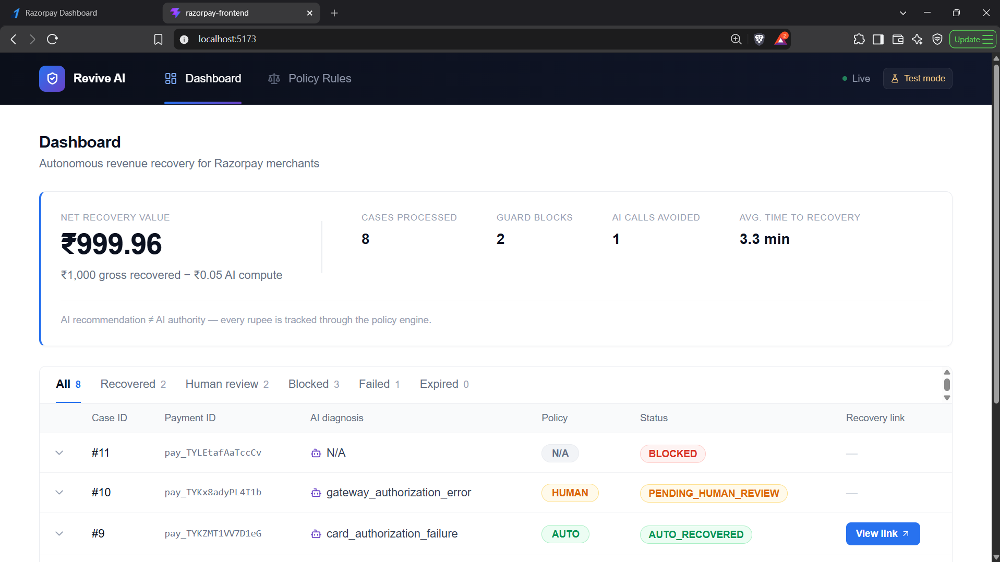
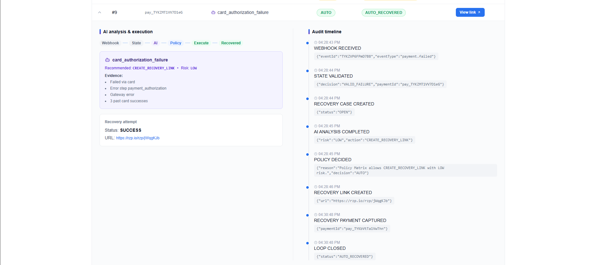

# Revive AI

### Autonomous Revenue Recovery for Razorpay

> **The AI recommends. The Policy Engine decides. Razorpay executes.**

**Built for Razorpay Buildathon — Track 3: AI Revenue Recovery**


---

## Table of Contents

- [Overview](#overview)
- [Key Highlights](#-key-highlights)
- [What Happened in a Real Test-Mode Run](#what-happened-in-a-real-test-mode-run)
- [How Revive Works](#how-revive-works)
- [Why the Architecture Is Intentionally Conservative](#why-the-architecture-is-intentionally-conservative)
- [The Concurrency Test That Found a Real Bug](#the-concurrency-test-that-found-a-real-bug)
- [Verified Scenarios](#verified-scenarios)
- [Real Razorpay Integration](#real-razorpay-integration)
- [The AI's Role](#the-ais-role)
- [Operations Console](#operations-console)
- [Auditability](#auditability)
- [Financial Accounting](#financial-accounting)
- [Engineering Highlights](#engineering-highlights)
- [Tech Stack](#tech-stack)
- [Repository Structure](#repository-structure)
- [Run Locally](#run-locally)
- [Design Principles](#design-principles)
- [Current Limitations](#current-limitations)

---

## Overview

A failed payment does not necessarily mean lost revenue. But blindly automating recovery creates another problem: duplicate collection, stale payment state, wasted compute, and unsafe decisions.

**Revive AI treats revenue recovery as a controlled decision system, not an unconditional retry.**

When a payment fails, Revive verifies the live Razorpay state, evaluates whether recovery is economically worthwhile, builds customer context, asks an LLM to diagnose the failure, and then passes that recommendation through deterministic policy rules before anything can happen.

Recovery is only considered successful when Razorpay confirms the customer's payment.

---

## 🏆 Key Highlights

- **Real, not simulated** — exercised against a live Razorpay test-mode account with real webhooks, real payment links, and real HMAC-verified events.
- **AI has no authority** — the LLM only recommends; a deterministic policy engine is the sole gate on every AUTO / HUMAN / BLOCK decision.
- **Zero-trust state verification** — live Razorpay state is re-fetched once before AI analysis and once again immediately before execution.
- **Found and fixed a real race condition** — a deliberate 5-webhook concurrency storm exposed a non-atomic state transition; traced it to the root cause and re-ran the storm to confirm zero duplicate executions.
- **At-most-once execution, enforced at the database layer** — atomic conditional updates plus a unique constraint on `RecoveryAttempt`, not just application logic.
- **Fail-safe by default** — every uncertain state (AI unavailable, malformed output, unverifiable payment state) degrades to `HUMAN` or `BLOCK`, never to silent autonomous action.
- **Full economics, not just recovery** — ₹1,000.00 gross recovered against ₹0.05 of AI compute cost in a real test run, with net value computed from the persisted financial ledger.
- **End-to-end auditability** — every case can answer *what happened, why, under which rule, what the live state was, and whether the customer actually paid.*

---

## What Happened in a Real Test-Mode Run

| Metric | Result |
|---|---:|
| Gross revenue recovered | **₹1,000.00** |
| AI compute cost | **₹0.05** |
| Net recovery value | **₹999.96** |
| Average end-to-end recovery (demo run) | **3.3 min** |
| Cases processed | **8** |
| AI calls avoided | **1** |
| Guard blocks | **2** |
| Unsafe executions | **0** |
| Duplicate recovery links | **0** |

The core recovery flow was exercised against a real Razorpay test-mode account. Failure and concurrency paths were additionally verified with controlled fault injection and replay tests.

The dashboard displays AI compute cost rounded to two decimal places. Net recovery value is calculated from the underlying persisted financial ledger.

The **3.3-minute figure is end-to-end recovery time**, measured as:

```
recoveredAt - createdAt
```

That starts when the failed-payment webhook opens the recovery case and ends when the subsequent `payment.captured` webhook confirms the recovery. It therefore includes the time taken by the customer to complete the recovery payment; the system's own processing happens within that window in seconds.



---

## How Revive Works

```text
                    Razorpay webhook
                           │
                           ▼
              HMAC SHA-256 verification
                           │
                           ▼
                  Webhook idempotency
                           │
                           ▼
               Zero-trust state validation
                           │
                      live Razorpay fetch
                           │
                           ▼
                  Economic floor gate
                           │
                           ▼
                  Context aggregation
                           │
                           ▼
                    AI Analyst
             diagnosis + evidence + action
                           │
                           ▼
                  Deterministic Policy
             action + risk + hard rules
                           │
              ┌────────────┼────────────┐
              ▼            ▼            ▼
             AUTO        HUMAN        BLOCK
              │            │            │
              ▼            ▼            ▼
           Execute       Pause        No money
                         safely         moves
              │
              ▼
       Razorpay Payment Link
              │
              ▼
       Customer completes payment
              │
              ▼
       payment.captured webhook
              │
              ▼
          AUTO_RECOVERED
```

**The important distinction is simple:**

> The LLM can recommend an action. It cannot authorize one.
>
> AI provides intelligence. Deterministic code provides authority.

---

## Why the Architecture Is Intentionally Conservative

Autonomous systems that touch money should not fail open. Revive therefore separates reasoning from authority.

### 1. Zero-trust payment state

A webhook is treated as a trigger, not as the source of truth. Revive re-fetches the payment directly from Razorpay before making a recovery decision, then performs another live-state check immediately before execution.

This protects against situations such as:

```text
        payment.failed webhook
                │
                ▼
        payment is captured elsewhere
                │
                ▼
        execution is about to happen
                │
                ▼
        live Razorpay state checked again
                │
                ▼
              BLOCK
```

> A human can override risk appetite. Nobody — not even a human — can override state safety.

### 2. Economic floor before AI

Not every failed payment is worth spending resources to recover.

```text
        ₹5 payment
           │
           ▼
        below configured ₹100 floor
           │
           ▼
         BLOCK
           │
           ▼
       AI is never called
```

This is enforced **before** the AI layer. Floor-blocked cases have no `AIAnalysis` record, providing direct evidence that the model was never consulted.

The floor isn't just about LLM cost — in production, recovery also carries gateway costs, review costs, customer-friction costs, and the cost of repeatedly contacting customers. The threshold is configurable rather than hard-coded as a universal business rule.

### 3. Hard rules the AI cannot override

The model's output is never accepted blindly. For example, a customer with no successful payment history is escalated to human review regardless of whether the model considers the action low risk.

> The policy matrix is code. The prompt is not a security boundary.

### 4. At-most-once execution

Money movement is protected at the database layer. Execution requires an atomic claim:

```sql
UPDATE ...
WHERE status = <expected_status>
```

Only the pipeline that successfully claims the case can execute the recovery action. A unique database constraint on `RecoveryAttempt` provides another layer of protection against duplicate execution.

### 5. Fail-safe defaults

Uncertainty never becomes permission.

| Condition | Outcome |
|---|---|
| AI unavailable | → `HUMAN` |
| Malformed AI output | → `HUMAN` |
| Razorpay state cannot be verified | → `BLOCK` / safe escalation |
| Unexpected execution failure | → `FAILED` |
| Unsafe live payment state | → `BLOCK` |

The system is designed so that an error stops the money-moving path rather than bypassing it.

### 6. Webhook idempotency

Razorpay webhook deliveries are identified using the webhook event ID and protected by a database uniqueness constraint. A replay of an already-processed event is absorbed rather than creating another recovery pipeline. This was verified through a real webhook followed by a replay of the same event.

### 7. Recovery has a real lifecycle

Creating a payment link is not considered recovery. A recovery case remains open until either:

```text
        customer pays
             ↓
      payment.captured
             ↓
       AUTO_RECOVERED
```

or:

```text
   recovery opportunity expires
             ↓
    payment_link.expired
             ↓
      RECOVERY_EXPIRED
```

Recovery links use Razorpay's expiry mechanism through `expire_by`.

---

## The Concurrency Test That Found a Real Bug

This was one of the most important engineering moments in the project.

We deliberately sent **five concurrent, correctly signed** `payment.failed` webhooks for the same payment.

The test initially exposed a real race condition in our own state-management logic: an unconditional intermediate status transition allowed a losing pipeline to temporarily move the case forward again after another pipeline had already claimed it.

The system's final defenses prevented duplicate money movement — but the test proved the state machine itself was **not sufficiently atomic**.

**We fixed the root cause rather than relying on the last line of defense.** Every consequential status transition was changed to a conditional atomic update:

```sql
UPDATE ... WHERE status = expected_status
```

Then we ran the storm again.

### Final result

```text
        5 concurrent webhooks
                │
                ├── 1 case created
                ├── 4 other pipelines encountered the same case
                │
                ▼
        4 reached the policy path
                │
                ├── 4 independent AI analyses → AUTO
                │
                ▼
        1 atomic execution claim won
                │
                ├── 3 pipelines aborted
                │
                ▼
        1 recovery attempt
                │
                ▼
        1 unique Razorpay payment link
                │
                ▼
        0 duplicate executions
```

The test didn't just prove the lock worked — **the test changed the implementation and made the system safer.**

> We test our safety claims by trying to break them.

---

## Verified Scenarios

All scenarios below were run against the system using real Razorpay test-mode flows.

| Scenario | Test | Result |
|---|---|---|
| **WIN** — Autonomous recovery | Failed payment → AI → AUTO → Razorpay link → customer payment | `AUTO_RECOVERED` |
| **HUMAN** — Safe escalation | Zero-history hard rule | `PENDING_HUMAN_REVIEW` |
| **GUARD** — Race condition | `payment.failed` webhook while live state is already captured | `BLOCKED` — no AI call, no money moved |
| **FLOOR** — Economic gate | ₹5 payment below the ₹100 recovery floor | `BLOCKED` — AI skipped |
| **EXPIRY** — Lifecycle | Recovery link reaches its TTL | `RECOVERY_EXPIRED` |
| **CONCURRENCY STORM** | 5 concurrent signed webhooks for the same payment | 1 attempt, 0 duplicate links |
| **EXECUTION FAILURE** | Razorpay API failure during execution | `FAILED` — error persisted safely |
| **DUPLICATE WEBHOOK** | Replay of an already-processed event | Duplicate absorbed |

---

## Real Razorpay Integration

Revive is not a simulated payment-recovery demo. The recovery path uses actual Razorpay test-mode infrastructure:

- Real Razorpay payment links
- Real Razorpay webhooks
- Real HMAC signature verification
- Real `payment.captured` events
- Real `payment_link.expired` lifecycle events
- Live payment-state fetches through the Razorpay API
- Recovery traceability embedded in Razorpay payment-link notes

Recovery links contain identifiers such as:

- `revive_recovery_case_id`
- `original_failed_payment_id`

This lets the eventual `payment.captured` webhook be associated with the correct recovery case without introducing another tracking service.

The AI also works with real application data:

- Razorpay payment failure information
- Actual failure reason / step / source
- Customer history from the local payment ledger
- Previous successful payment methods

There is no mock customer history feeding the decision.

---

## The AI's Role

The AI Analyst produces a structured recommendation:

- Diagnosis
- Evidence
- Recommended action
- Risk level

The output is strictly validated against allowed actions and risk levels.

**Model used:** `openai/gpt-oss-20b` via the **Groq API**.

```text
        AI
        │
        ├── understands the failure
        ├── gathers meaning from context
        └── recommends an intervention
                 │
                 ▼
        Policy Engine
        │
        ├── applies hard rules
        ├── checks risk
        ├── verifies live state again
        └── authorizes AUTO / HUMAN / BLOCK
                 │
                 ▼
        Execution Layer
        │
        └── performs the allowed Razorpay action
```

> The AI is an advisor, not an authority.

---

## Operations Console

Revive includes a live operations console built around the same decision model as the backend. It is not just a dashboard — the UI makes the system's reasoning and safety boundaries visible.

**Decision trace** — each case exposes its progression through:

```text
        Webhook
           ↓
        State validation
           ↓
        AI analysis
           ↓
        Policy decision
           ↓
        Execution
           ↓
        Recovery outcome
```

When a guard fires, the chain visibly stops at the layer that made the decision.



- **Audit timeline** — every consequential event recorded chronologically with metadata, so an operator can reconstruct what happened and why.
- **Honest reason cards** — blocked and escalated cases display the actual reason from the backend audit trail, not hard-coded frontend explanations.
- **Policy rules** — the frontend exposes the active policy configuration governing autonomous decisions.
- Live polling
- Case / status filters
- Recovery links
- Financial impact
- New-case feedback
- Per-case decision traces
- Audit timelines

---

## Auditability

Every consequential stage leaves an auditable trail:

```text
        WEBHOOK_RECEIVED
                ↓
        STATE_VALIDATED
                ↓
        RECOVERY_CASE_CREATED
                ↓
        AI_ANALYSIS_COMPLETED
                ↓
        POLICY_DECIDED
                ↓
        RECOVERY_LINK_CREATED
                ↓
        RECOVERY_PAYMENT_CAPTURED
                ↓
        LOOP_CLOSED
```

This matters because an autonomous money-moving system should be able to answer:

- What happened?
- Why did it happen?
- Which rule allowed it?
- What was the live payment state at the time?
- Did the customer actually pay?

---

## Financial Accounting

AI usage is tracked from the actual token usage returned by the model API.

For the demonstrated recovery:

```text
        Gross recovered       ₹1,000.000
        AI compute cost        ₹0.05
        ──────────────────────────────
        Net recovery value    ₹999.96
```

The dashboard displays AI cost rounded to two decimal places. Recovery economics are measured **separately** from the AI recommendation itself.

---

## Engineering Highlights

- Timing-safe webhook signature comparison using `crypto.timingSafeEqual`
- HMAC SHA-256 verification over the raw webhook body
- Database-backed webhook idempotency
- Live Razorpay state validation before policy evaluation
- A second live-state check immediately before execution
- Conditional atomic state transitions
- Database uniqueness protection on recovery attempts
- Strict validation of AI output
- Fail-safe handling of AI/API failures
- Paise-precision financial calculations
- Persisted token usage and AI cost accounting
- Recovery-case lifecycle tracking
- Boot-time cleanup of orphaned transient states
- Crash-tolerant concurrent upserts
- Explicit handling of unexpected webhook payload shapes
- Environment-gated development tools

---

## Tech Stack

| Layer | Stack |
|---|---|
| **Backend** | Node.js, TypeScript, Express, Prisma, PostgreSQL |
| **AI** | Groq API, `openai/gpt-oss-20b` |
| **Payments** | Razorpay Node SDK, Razorpay Webhooks, Razorpay Payment Links |
| **Frontend** | React, Vite, TypeScript, Tailwind CSS |

---

## Repository Structure

```text
revive-ai/
│
├── frontend/
│   ├── src/
│   ├── public/
│   ├── package.json
│   └── README.md
│
├── backend/
│   ├── src/
│   ├── prisma/
│   ├── package.json
│   └── PROJECT_STATE.md
│
├── docs/
│   └── evidence/
│       ├── concurrency-storm.txt
│       ├── concurrency-storm-full.log
│       ├── duplicate-webhook.txt
│       └── execution-failure.txt
│
├── .gitignore
└── README.md
```

The frontend and backend were developed as separate repositories and combined here for a single, complete project submission. Their development histories are preserved.

---

## Run Locally

### Prerequisites

- Node.js
- PostgreSQL
- Razorpay test-mode account
- Groq API key

### 1. Clone

```bash
git clone https://github.com/Aadarsh6/Revenue-Recover-Razorpay-AI.git
cd Revenue-Recover-Razorpay-AI
```

### 2. Backend

```bash
cd backend
npm install
```

Create a `.env` file:

```env
RAZORPAY_KEY_ID=
RAZORPAY_KEY_SECRET=
RAZORPAY_WEBHOOK_SECRET=

GROQ_API_KEY=

DATABASE_URL=

MIN_RECOVERY_AMOUNT_PAISE=10000
RECOVERY_LINK_TTL_MINUTES=60

ESTIMATED_COST_PER_1K_TOKENS_INR=

SKIP_SIGNATURE_VALIDATION=false
```

Configure the database and run the Prisma migrations/generation required by the project. Then start the backend:

```bash
npm run dev
```

### 3. Frontend

In another terminal:

```bash
cd frontend
npm install
npm run dev
```

The frontend will connect to the running backend API.

> **Never commit `.env` files or API credentials.** The root `.gitignore` excludes environment files from Git.

---

## Design Principles

Revive is built around a few simple rules:

1. **Webhooks trigger investigation. Live APIs establish truth.**
   A webhook tells us that something happened. Razorpay's live API tells us what the payment actually is *now*.

2. **AI provides intelligence. Code provides authority.**
   The model can reason about a payment failure. It cannot authorize money movement.

3. **Uncertainty stops execution.**
   If state, AI output, or execution cannot be trusted, the system does not guess.

4. **Recovery is not link creation.**
   A recovery opportunity is only closed when the customer's payment is actually captured.

5. **Concurrency is part of correctness.**
   If two workers can execute the same recovery, the system is not safe. Revive treats race conditions and duplicate execution as correctness problems, not edge cases.

---

## Current Limitations

Revive is a buildathon system, not a production payment-recovery platform. The current implementation intentionally leaves several production extensions for future work:

- Complete human-review resolution flow
- Runtime stale-lock sweeper
- More robust phone/contact normalization
- Batch evaluation harness for measuring policy performance across larger datasets
- Further production deployment and distributed-worker hardening

The current human-review path pauses safely rather than silently falling through to autonomous execution.

---

## Built for Razorpay Buildathon — Track 3

**AI Revenue Recovery: Find revenue that is slipping away and win it back.**

The project focuses on the difficult part of autonomous revenue recovery: not simply identifying a failed payment, but deciding **when recovery is worth attempting**, **what intervention is appropriate**, and **when the system must stop**.

```text
        AI recommends
             ↓
        Policy constrains
             ↓
        Database guarantees execution ownership
             ↓
        Razorpay performs the payment action
             ↓
        Webhook confirms the outcome
```
